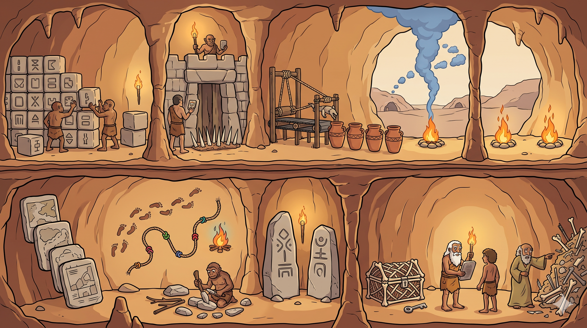

# Handoff: "A Caverna Arquitetada" — Objeto educacional com figura interligada

## Overview
Objeto educacional que ensina 12 conceitos de **Arquitetura de Software** mapeados
para uma metáfora pré-histórica (a tribo da caverna). A entrega transforma o objeto
original — onde os 12 conceitos eram **12 caixas SVG abstratas isoladas** — numa
**única ilustração coesa** (corte transversal de uma caverna) onde cada região da
arte é um conceito interativo. A figura carrega proximidade, fluxo e escala que as
caixas soltas não comunicavam: o aluno aprende por espaço e história, vendo como os
conceitos convivem no mesmo sistema (macro em cima, micro embaixo).

Objeto original de referência: repositório `danzeroum/animacao_educacional`, pasta
`arquitetura-de-software-caverna` (um `index.html` com um `<svg>` de 12 caixas + um
dicionário `CONCEITOS`). **O conteúdo textual (`CONCEITOS`) deve ser preservado** —
o que muda é o "palco".

## About the Design Files
Os arquivos deste bundle são **referências de design feitas em HTML** — um protótipo
funcional que mostra a aparência e o comportamento pretendidos, **não** código de
produção para copiar literalmente. A tarefa é **recriar este design no ambiente do
codebase-alvo** (o objeto educacional existente, que é HTML/CSS/JS vanilla), seguindo
seus padrões. Como o objeto original já é HTML vanilla, a implementação pode ser
bastante direta — mas a estrutura de componentes do protótipo (classe lógica + props)
é específica da ferramenta de design e deve ser traduzida para HTML/JS simples.

O protótipo foi construído como um "Design Component" (`.dc.html`). Ignore a sintaxe
de runtime (`<x-dc>`, `<sc-for>`, `class Component extends DCLogic`, `renderVals`) —
ela é andaime da ferramenta. O que importa é **o conteúdo, o layout, as posições dos
hotspots, as cores, as interações e o dicionário de dados**, tudo documentado abaixo.

## Fidelity
**Alta fidelidade (hifi).** Cores, tipografia, espaçamentos, posições de hotspots em
%, estados de hover/active e o conteúdo completo dos 12 conceitos estão finalizados.
Recrie pixel-a-pixel usando HTML/CSS/JS vanilla (ou o framework do projeto, se houver).

## A grande ideia (o que torna o objeto melhor)
- **Antes:** 12 caixas SVG abstratas, lado a lado → o aluno decora 12 fatos isolados.
- **Depois:** a própria ilustração é a interface. Cada setor da caverna é um botão.
  Hover → contorno + glow na cor do conceito. Clique → modal com a metáfora, bullets,
  ferramentas reais e dica de arquiteto.
- **Fase 2 (já implementada):** ao abrir um conceito, a figura "acende" o sub-sistema:
  o setor ativo ganha halo forte, os relacionados pulsam com contorno tracejado, e o
  resto escurece. O modal lista chips clicáveis "🔗 Conecta-se com" que saltam entre
  conceitos relacionados. É o que materializa a leitura **Macro ↔ Micro**.

## Layout geral
Página de coluna única, centralizada, `max-width: 1180px`, fundo escuro de caverna:
`radial-gradient(120% 80% at 50% 0%, #2a1c10 0%, #160e07 55%, #100a05 100%)`.
Ordem vertical das seções:
1. **Cabeçalho** — kicker + `<h1>` "A Caverna Arquitetada" + parágrafo de tese.
2. **Antes vs Depois** — 2 cards em grid explicando a mudança de abordagem.
3. **Figura interativa** — o coração do objeto (ver abaixo).
4. **Legenda numerada** — 12 itens clicáveis (rota acessível alternativa aos hotspots).
5. **Modal** — overlay com o conteúdo do conceito.
6. **Orientações para o Dev** (opcional, atrás de flag `mostrarPainelDev`).
7. **Rodapé** — citação de fechamento.

## A FIGURA INTERATIVA (componente central)
Container com proporção fixa e hotspots ancorados em porcentagem — escala em qualquer
tela sem recalcular pixels:

```html
<div style="position:relative; width:100%; aspect-ratio:2752 / 1536;
            border-radius:16px; overflow:hidden; border:1px solid #4a3826;
            box-shadow:0 24px 60px -20px rgba(0,0,0,.8)">
  
  <!-- 1 <button> por conceito, posicionado em % (tabela abaixo) -->
  <button class="hotspot" data-conceito="escalabilidade"
          style="position:absolute; left:1%; top:12%; width:22%; height:34%"></button>
  <!-- ...12 hotspots... -->
</div>
```

- A arte é o fundo; os hotspots são `<button>` **transparentes** sobrepostos.
- Em repouso: um marcador pulsante discreto (ponto + anel) no centro do hotspot
  sinaliza "clique aqui". Hover: `border` + `box-shadow` (glow) na cor do conceito.
- Imagem final: `caverna-arquitetada-v2.png` (2752×1536, 16:9). **Sem texto queimado**
  — todos os rótulos vêm do HTML (permite i18n, correção e leitor de tela).

### Posições dos hotspots (em % do container, já calibradas)
Formato: `left, top, width, height` (todos em %).

**Faixa superior — Macro (a tribo):**
- `escalabilidade` — `1, 12, 22, 34` (blocos modulares sendo empilhados, à esquerda)
- `seguranca` — `25.5, 5, 17, 42` (portão fortificado + espinhos de osso)
- `devops` — `44, 18, 19, 28` (máquina automatizada + vasos de argila enfileirados)
- `cloud` — `63, 3, 18, 43` (coluna de fumaça azul para cavernas distantes)
- `redundancia` — `82, 27, 17, 20` (duas fogueiras gêmeas, à direita)

**Faixa inferior — Micro (os detalhes):**
- `c4` — `2.5, 60, 14.5, 35` (tábuas de pedra em camadas)
- `observabilidade` — `18, 54, 22, 37` (pegadas + corda de nós + fogueira de cor)
- `refatoracao` — `33, 71, 16, 26` (troglodita reconstruindo ferramenta)
- `leis` — `48, 57, 14, 39` (dois menires gravados)
- `cofre` — `60.5, 73, 14, 23` (cofre de ossos + chave-pedra)
- `conformidade` — `74, 61, 16, 36` (ancião entregando tábua a um jovem)
- `divida` — `89.5, 60, 10, 37` (pilha de ferramentas quebradas + sábio apontando)

> Se a arte for regenerada/trocada, re-calibrar estas 12 caixas é o único ajuste
> necessário no overlay.

## Continua em README-PARTE-2.md
Conteúdo dos 12 conceitos, modal, interações, design tokens, estado e arquivos.
