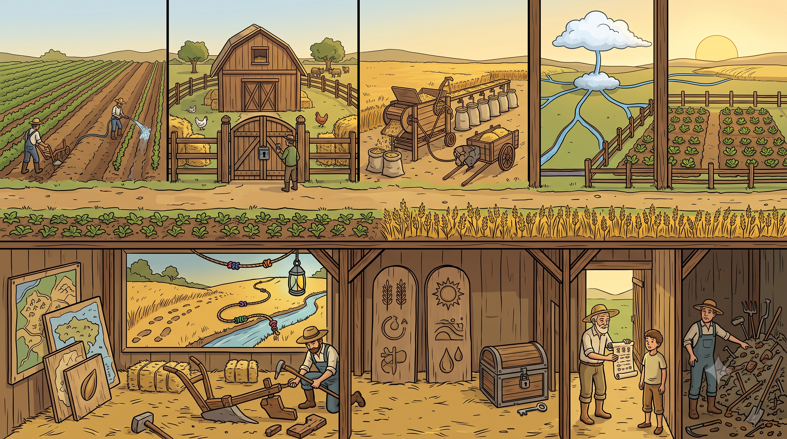

# Handoff: "A Aldeia Arquitetada" — Objeto educacional com figura interligada

## Overview
Objeto educacional que ensina 12 conceitos de **Arquitetura de Software** mapeados
para uma metáfora rural (a aldeia agrícola). A entrega transforma o objeto original —
onde os 12 conceitos eram **12 caixas SVG abstratas isoladas** — numa **única
ilustração coesa** (corte transversal de uma aldeia, estilo "casa de boneca") onde
cada nicho da arte é um conceito interativo. A figura carrega proximidade, fluxo e
escala que as caixas soltas não comunicavam: o aluno aprende por espaço e história,
vendo como os conceitos convivem no mesmo sistema (**macro** na faixa superior, ao ar
livre; **micro** na faixa inferior, dentro do celeiro).

> Esta é a variante "aldeia" de um objeto que também existe na versão "caverna
> pré-histórica". As duas compartilham exatamente a mesma mecânica e o mesmo conteúdo
> técnico — só muda o "palco" (a ilustração e as metáforas narrativas). O conteúdo
> textual (`CONCEITOS`) está finalizado e deve ser preservado.

## ⚠️ IMPORTANTE — Remover andaime de autor no objeto final
O protótipo inclui DUAS seções que são **explicação da reformulação para quem aprova
o design**, e **NÃO** fazem parte do objeto que o aluno vê. **Remova as duas na
implementação final:**

1. **Seção "Antes · objetos sozinhos / Depois · conhecimento integrado"** (os dois
   cards de tese logo abaixo do cabeçalho). É a justificativa do redesenho — útil no
   handoff, ruído para o aluno. **Apagar.**
   > Texto a remover (verbatim): *"Antes · objetos sozinhos — 12 caixinhas SVG
   > abstratas, lado a lado…"* e *"Depois · conhecimento integrado — Uma cena única.
   > A escalabilidade nas leiras…"*

2. **Seção "Handoff / Orientações para o Dev"** (o painel com os 8 cards numerados +
   o snippet de código). No protótipo já está atrás da flag `mostrarPainelDev`; no
   objeto final **não deve ser renderizada** (remova a seção ou deixe a flag `false`
   e sem caminho para ligá-la).

Tudo o mais (cabeçalho, figura interativa, legenda, modal, tour, rodapé) permanece.
O objeto final do aluno é, em ordem: **cabeçalho → figura interativa → legenda
numerada → (modal sob demanda) → rodapé**.

## About the Design Files
Os arquivos deste bundle são **referências de design feitas em HTML** — um protótipo
funcional que mostra a aparência e o comportamento pretendidos, **não** código de
produção para copiar literalmente. A tarefa é **recriar este design no ambiente do
codebase-alvo** (o objeto educacional existente, que é HTML/CSS/JS vanilla), seguindo
seus padrões. Como o objeto original já é HTML vanilla, a implementação pode ser
bastante direta — mas a estrutura de componentes do protótipo (classe lógica + props)
é específica da ferramenta de design e deve ser traduzida para HTML/JS simples.

O protótipo foi construído como um "Design Component" (`.dc.html`). Ignore a sintaxe
de runtime (`<x-dc>`, `<sc-for>`, `<sc-if>`, `class Component extends DCLogic`,
`renderVals`) — é andaime da ferramenta. O que importa é **o conteúdo, o layout, as
posições dos hotspots, as cores, as interações e o dicionário de dados**, tudo
documentado aqui e na Parte 2.

## Fidelity
**Alta fidelidade (hifi).** Cores, tipografia, espaçamentos, posições de hotspots em
%, estados de hover/active e o conteúdo completo dos 12 conceitos estão finalizados.
Recrie pixel-a-pixel usando HTML/CSS/JS vanilla (ou o framework do projeto, se houver).

## A grande ideia (o que torna o objeto melhor)
- **Antes:** 12 caixas SVG abstratas, lado a lado → o aluno decora 12 fatos isolados.
- **Depois:** a própria ilustração é a interface. Cada nicho da aldeia é um botão.
  Hover → contorno + glow na cor do conceito. Clique → modal com a metáfora, bullets,
  ferramentas reais e dica de arquiteto.
- **Fase 2 (já implementada):** ao abrir um conceito, a figura "acende" o sub-sistema:
  o nicho ativo ganha halo forte, os relacionados pulsam com contorno tracejado, e o
  resto escurece. O modal lista chips clicáveis "🔗 Conecta-se com" que saltam entre
  conceitos relacionados. É o que materializa a leitura **Macro ↔ Micro**.

## Layout geral
Página de coluna única, centralizada, `max-width: 1180px`, fundo claro de campo:
`radial-gradient(125% 85% at 50% -5%, #f4ecd6 0%, #ecdfc0 52%, #e2d2af 100%)`.
Ordem vertical das seções **no objeto final (já sem o andaime de autor)**:
1. **Cabeçalho** — kicker + `<h1>` "A Aldeia Arquitetada" + parágrafo de tese.
2. **Figura interativa** — o coração do objeto (ver abaixo).
3. **Legenda numerada** — 12 itens clicáveis (rota acessível alternativa aos hotspots).
4. **Modal** — overlay com o conteúdo do conceito (sob demanda).
5. **Rodapé** — citação de fechamento.

> No protótipo, entre (1) e (2) há a seção "Antes vs Depois" e, depois do modal, a
> seção "Orientações para o Dev". **Ambas saem no objeto final** (ver aviso acima).

## A FIGURA INTERATIVA (componente central)
Container com proporção fixa e hotspots ancorados em porcentagem — escala em qualquer
tela sem recalcular pixels:

```html
<div style="position:relative; width:100%; aspect-ratio:2752 / 1536;
            border-radius:16px; overflow:hidden; border:1px solid #b89255;
            box-shadow:0 24px 60px -22px rgba(74,52,21,.55)">
  
  <!-- 1 <button> por conceito, posicionado em % (tabela abaixo) -->
  <button class="hotspot" data-conceito="escalabilidade"
          style="position:absolute; left:0.5%; top:12%; width:20%; height:31%"></button>
  <!-- ...12 hotspots... -->
</div>
```

- A arte é o fundo; os hotspots são `<button>` **transparentes** sobrepostos.
- Em repouso: um marcador discreto (disco numerado por padrão, ou ponto+anel pulsante)
  no centro do hotspot sinaliza "clique aqui". Hover: `border` + `box-shadow` (glow)
  na cor do conceito.
- Imagem final: `aldeia-arquitetada.png` (2752×1536, 16:9). **Sem texto queimado** —
  todos os rótulos vêm do HTML (permite i18n, correção e leitor de tela).

### Posições dos hotspots (em % do container, já calibradas)
Formato: `left, top, width, height` (todos em %).

**Faixa superior — Macro (a aldeia, ao ar livre):**
- `escalabilidade` — `0.5, 12, 20, 31` (dois agricultores arando/irrigando novas leiras, à esquerda)
- `seguranca` — `21.5, 7, 21, 37` (celeiro + portão com fechadura + guardião)
- `devops` — `43.5, 11, 18, 33` (debulhadora + sacas/silos enfileirados + carro de boi)
- `cloud` — `62, 3, 16.5, 40` (reservatório-nuvem + canais de água azul ramificando)
- `redundancia` — `80, 11, 19, 33` (duas hortas gêmeas espelhadas, à direita, ao pôr do sol)

**Faixa inferior — Micro (dentro do celeiro):**
- `c4` — `0.5, 61, 13.5, 35` (painéis/mapas de madeira em camadas, encostados na parede)
- `observabilidade` — `14.5, 56, 23, 22` (mural: pegadas + corda de nós coloridos + lanterna)
- `refatoracao` — `26, 79, 17, 19` (agricultor reconstruindo o arado, no chão)
- `leis` — `43, 60, 14, 37` (duas tábuas gravadas verticais ao centro)
- `cofre` — `57.5, 72, 11, 23` (baú de sementes trancado + chave única)
- `conformidade` — `68, 61, 16, 36` (ancião entregando rolo de regras a um jovem, no vão da porta)
- `divida` — `85, 60, 14.5, 38` (pilha de ferramentas enferrujadas + agricultor preocupado, à direita)

> Se a arte for regenerada/trocada, re-calibrar estas 12 caixas é o único ajuste
> necessário no overlay.

## Continua em README-PARTE-2.md
Conteúdo dos 12 conceitos, modal, interações, design tokens, estado e arquivos.
